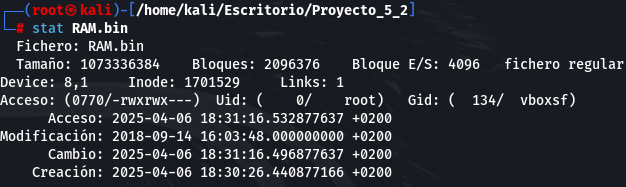

# Proyecto 5-2: Defacement Attack

## 1. Perfil de la memoria

Para conseguir el perfil de la imagen hemos utilizado volatility con el siguiente comando:

```bash
vol.py -f RAM.bin imageinfo
```

Y nos ha dado el siguiente resultado.


Una vez visto que no hay un perfil lo que hemos hecho para conseguir el perfil es mirar en los strings la versión de Linux que puede tener para ello hemos utilizado el siguiente comando.

```bash
strings RAM.bin | grep -i "Linux version"
```

Este comando lo que hace es mirar en el archivo `RAM.bin` y filtra las coincidencias con la cadena que le hemos pasado en el grep y esto nos ha dado la siguiente salida.


Esto quiere decir que la version del `kernel` que tiene es la `4.4.0-1061-aws`, luego versión que tiene es un `Ubuntu 16.04.9`

## Cargar el perfil

Para cargar el perfil nos hemos metido en la siguiente página <https://launchpad.net/~canonical-kernel-team/+archive/ubuntu/ppa/+build/14938851> y nos hemos descargado el perfil correcto que era el de la versión `4.4.0-1061-aws`


Una vez descargado lo metemos en la máquina y descomprimimos y nos bajamos estos dos repositorios.

```bash
git clone [https://github.com/volatilityfoundation/dwarf2json.git](https://github.com/volatilityfoundation/dwarf2json.git "https://github.com/volatilityfoundation/dwarf2json.git")

git clone [https://github.com/volatilityfoundation/volatility3.git](https://github.com/volatilityfoundation/volatility3.git "https://github.com/volatilityfoundation/volatility3.git")
```

## Información memoria RAM

Tamaño: 1.048.181 KB (1.048181 GB).

MAC Time:

- Acceso: 2025-04-06 18:31:16.532877637 +0200
- Modificación: 2018-09-14 16:03:48.000000000 +0200
- Cambio: 2025-04-06 18:31:16.496877637 +0200
- Creación: 2025-04-06 18:30:26.440877166 +0200



Valor Hash:

- MD5: e063c257d2f41ddee65ea1fdabe64e95
- SHA1: bc2ebb435e75b3406280a2967b1c2696fc3e160a


Otros atributos: se nos ha proporcionado un archivo Binario el cual hemos tenido que analizar con Volatility3.

## Evidencias Recolectadas

### Procesos Activos

- Archivo Analizado: `output_PsList.json`

- Comando Volatility:

    ```bash
    python3 vol.py -f ../RAM.bin linux.pslist.PsList > output_PsList.json
    ```

- Hallazgos Relevantes:

  - Proceso 9126 (bash): Ejecutó comandos críticos como instalación de Apache, MySQL, y Let's Encrypt (ver bash.txt).

  - Proceso 27428 (apache2): Iniciado el 20/07/2018 10:04:02 UTC. Múltiples instancias hijas (PID 5573, 5763, etc.).

### Actividad en bash

- Archivo Analizado: `bash.txt`

- Comando Volatility:

    ```bash
    python3 vol.py -f ../RAM.bin linux.bash.Bash > bash.txt
    ```

- Hallazgo relevantes:

  - Configuración de Apache y SSL:

    ```bash
        sudo letsencrypt --apache -d ganga.site -d www.ganga.site
    ```

  - Conexiones a MySQL remoto:

    ```bash
    mysql -u admin -p -h ganga.ctmbcxcdb3us.eu-central-1.rds.amazonaws.com
    ```

### Módulos del Kernel cargados

- Archivo analizado: `pslmod.json`

- Comando Volatility:

    ```bash
    python3 vol.py -f ../RAM.bin linux.lsmod.Lsmod > pslmod.json
    ```

- Hallazgo relevantes:

    `"path=memoria.bin", "format=lime", "OOT_MODULE,UNSIGNED_MODULE"`

### Regiones de memorias sospechosas

- Archivo analizado: `malfind.txt`

- Comando Volatility:

    ```bash
    python3 vol.py -f ../RAM.bin linux.malfind.Malfind > malfind.txt
    ```

- Hallazgo relevantes:

  - Proceso Apache2 (PID 5573, 6266, etc.): Regiones rwx en direcciones como 0x7f0663ff3000.

  - Código Ejecutable: Hexdump muestra instrucciones de ensamblador no asociadas a Apache.

### Configuración de red

- Archivo analizado: `ippadr.txt`

- Comando Volatility:

    ```bash
    python3 vol.py -f ../RAM.bin linux.ip.Addr > ipaddr.txt 
    ```

- Hallazgo relevantes:

  - IP Pública: 172.31.47.60 (AWS EC2).

  - Conexión SSH: Proceso sshd (PID 9055) activo.

## Cronología

1. 20/07/2018 09:10:25 UTC: Inicio del sistema.

2. 20/07/2018 10:04:02 UTC: Apache2 inicia servicio web.

3. 24/07/2018 05:24:19 UTC:

    1. Instalación de LiME y compilación del módulo del kernel.

    2. Configuración repetida de Let's Encrypt (posible error o intento de suplantación).

4. 24/07/2018 05:27:03 UTC: Captura de memoria con LiME (insmod).

## Hallazgos Clave

- Múltiples ediciones en /etc/apache2/sites-enabled/000-default-le-ssl.conf.

- Eliminación de index.html (sudo rm index.html).

- Inyección de Código: Regiones rwx en Apache sugieren shellcode o backdoor.

- Acceso Remoto: Conexiones a MySQL en AWS RDS y actividad SSH.
